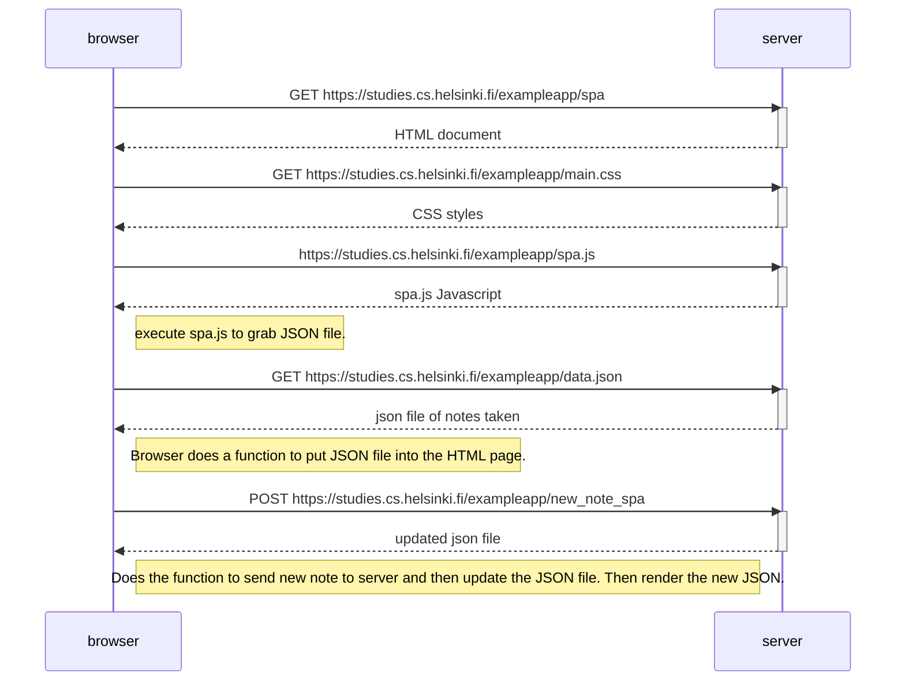

```mermaid
sequenceDiagram
  participant browser
  participant server

  browser->>server: GET https://studies.cs.helsinki.fi/exampleapp/spa
  activate server
  server-->>browser: HTML document
  deactivate server

  browser->>server: GET https://studies.cs.helsinki.fi/exampleapp/main.css
  activate server
  server-->>browser: CSS styles
  deactivate server

  browser->>server: https://studies.cs.helsinki.fi/exampleapp/spa.js
  activate server
  server-->>browser: spa.js Javascript
  deactivate server
Note right of browser: execute spa.js to grab JSON file.

  browser->>server: GET https://studies.cs.helsinki.fi/exampleapp/data.json
  activate server
  server-->>browser:  json file of notes taken
  deactivate server
Note right of browser: Browser does a function to put JSON file into the HTML page. 

  browser->>server: POST https://studies.cs.helsinki.fi/exampleapp/new_note_spa
  activate server
  server-->>browser: updated json file
  deactivate server
Note right of browser: Does the function to send new note to server and then update the JSON file. Then render the new JSON.
```
